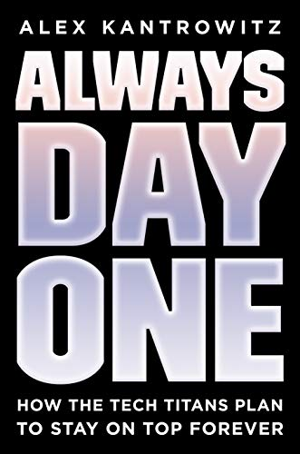

---
---

<!--


  

  <li class="posts-list-item">
    

      <h3 class="title">
        <a href="{{ post.url }}">
          {{ post.title }}
        </a>
      </h3>
      
        
      
    

  </li>

  {{ post.content | strip_html | truncatewords: site.excerpt_word_count }} [Read more]({{ post.url }})

  



  <h3 class="title">
    <a href="https://www.w3schools.com/html/html_links.asp">
      Why these Anti-trust Hearings are Necessary
    </a>
  </h3>
  
    March 10, 2020
  

  

-->

*~ in progress ~*
